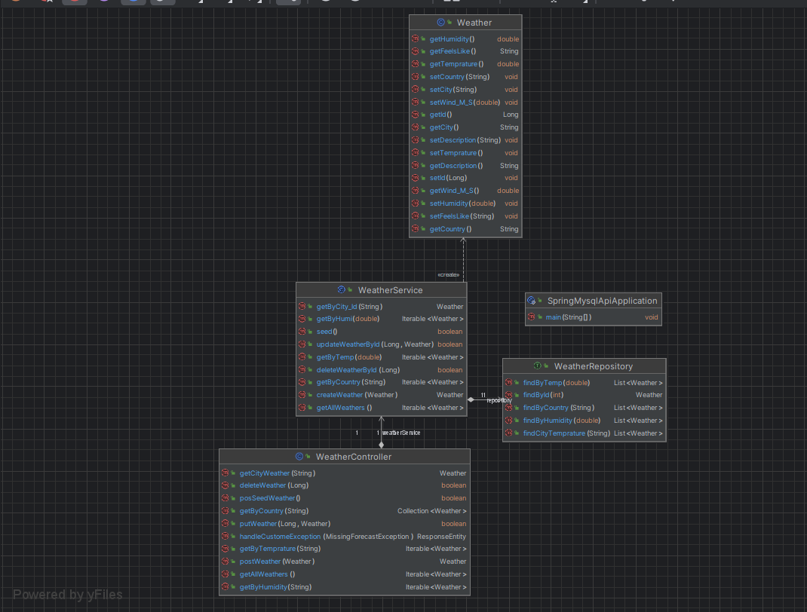
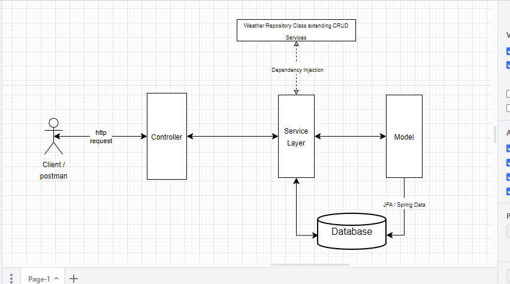

<!-- TABLE OF CONTENTS -->

## Table Of Contents
- --
* [About The Project](#about-the-project)
* [Description: When You Run The Program](#description-when-you-run-the-program)
* [Installation](#what-is-requiredinstallation)
* [GitHub Push/Pull](#github-pushpull-request)
* [How To Use](#how-to-use)
* [UML](#uml)
* [Test class](#test-class)
* [Notes](#notes)
* [__Contacts__](#contact)
- --

## _About The Project_:

- The main purpose of this Springboot project is to receive and display for the client __(*weathers*)__ for __*country's*__ and the *__cities__* in the *__countrys__*.
- The client can run the application through a (_dockerfile_)[Docker](#how-to-use-docker)
- The (_Cucumber-file_) describe the scenarios the client is expecting for the function of the application. [Cucumber](#how-to-use-cucumberbddtdd)
-  ***building/development with TDD/BDD***.
- The deployment tests (_CI/CD_) have been through configuration by (_auto-update when a push from github-desktop is done_) the deployment is checked by (*ACTIONS*) on *GITHUB*. (directory)[Workflows](#how-to-use-cicd)
- The project has one repository `(WeatherRepository)` connection with `SQL script` makes the clutch to the DataBase.
---
* (_directory_) [Repositories](#how-to-use-the-function-of-weatherrepository)
- - **WeatherRepository**
---
* The project classes:

- * (_directory_)[Controllers](#how-to-use-the-functions-of-weathercontroller)
- - **WeatherController**
---
 - * (_directory_) [Models](#how-to-use-the-function-of-weather)
- - **Weather**
---
- * (_directory_) [Services](#how-to-use-the-function-of-weatherservice)
- - **WeatherService**
- - **SpringMysqlApiApplication**
---
- * (_directory_) [Exception](#how-to-use-the-function-of-exception)
---
- * [Test class](#test-class)
- - **SpringMysqlApiApplicationTests**
- - **WeatherControllerTests**
- --
## _Description: When You Run The Program_:
- Check what you are running and watch out for using wrong `spring.datasource.url`
- 
- In order for auto update, the DataBase automatically use `spring.jpa.hibernate.ddl-auto=update
- In order for none automatically update use #spring.jpa.hibernate.ddl-auto=create-drop

#### What you need, general steps:
1. First of all you need to run the installation process --> [Installation](#what-is-requiredinstallation)

- -- 
## _What Is Required/Installation_:

1. Check in (_*Linux*_) or (_*Ubuntu*_) if java is installed by using command (__java -version__)
2. Installation of (__Intellij__) or an integrated Development Environments (IDE).
3. Check in (_*Linux*_) or (_*Ubuntu*_) if the version exists by using command --version
4. The Next designation to type in is: (__sudo apt install openjdk-19-jdk-headless__).
   You can install more types of java versions by enter
   designation __(sudo update-alternatives --config java__).
5. Then choose which version you want, auto or manual will of the versions will pop up as a choice! Please enter the auto version.
- --
#### Installation of spring and requirement for the whole cycles domains for the application
1. Step one is to develop your spring environment I did it by using _(*Spring initializer*)_ [https://start.spring.io/;](https://start.spring.io/;)
2. Step two is to download DB-gate and _(*DB-gate*)_ [https://dbgate.org/](https://dbgate.org/)
3. Step three download mysql and use the tutorial on the website _(*MYsql*)_ [https://www.mysql.com/](https://www.mysql.com/)
4. Step four is to download the client/(_Postman_)! [https://www.postman.com/](https://www.postman.com/)
5. Step five is to download _*DOCKER*_ [https://hub.docker.com/](https://hub.docker.com/)
___
#### Other inclusions that are not dependent on installation
- _Short list of other_
1. For UML diagrams I used and recommend (_*Draw.io*_) [https://www.drawio.com/](https://www.drawio.com/)
---
##### Github Push/Pull request

The code is private but reach me in my contact link for fork/clone of the code.

- --
## _How To Use_:

## _How To Use Docker_:
- First of all, you have to create a docker file in your project.
- In order for the docker file to work, you need to have the right commands, you find them in my docker file.
#### General description of Docker
_*Docker description*_: 
- **_Operation of docker_**
- `Docker is a platform as service, (PaaS) that use (OS) virtualization to deliver software in package and a fully automated the process of deployment lightweight containers so the applications can work efficiently in different environments in isolation.`
- _**How does DOCKER run the program**_:
- `To run the docker file you need to create the file and write the commands in the file, also its important that if not change already ois made (the line separator needs to be in "LF") `
- _**Docker (terminal) commands**_:
- `docker build -t my-java-app .` (Is building the Docker-image)
- `docker run my-java-app` (Docker run command is staring the container based on your image)
## _How To Use Cucumber/BDD/TDD_:
#### General description of Cucumber:
_*Cucumber description*_:
- *Cucumber* / *BDD*-`(Behavior driven development)`: builds on and extends *TDD*-`(Test driven development)` by focusing on the system's behavior from the user's perspective.
#### How I applied BBD and TDD:
- The reason I started using *BDD* `/ given / when / then` the three scenarios made my vision easier in the process to start to develop the program and get the big picture.
- - _*Given*_ *`-(A specific scenario or starting point)`*
- - _*When*_ *`-(An event that triggers something)`*
- - _*Then*_ *`-(The desired outcome or behavior)`*
- TDD was used after the first `end point was created *getAllWeathers*`
  because the process of using *`Mocking`* was in need of functional flow through the client to the Base
in order to create the Mock application.properties, I managed to test the first function in the controller. 
 After wards, I developed the whole controller through the test environment.
 Later on, I simplified the test by only having three tests.
## _How To Use CI/CD_
##### -_*(Continuous Integration/Continuous Deployment)*_
#### _General description of CI/CD functionality_
- *Continuous integration*:
- - Continuous integration is a DevOps best practice
that involves automating the integration of code changes from `multiple contributors` into a `single software project.`
This allows developers to frequently merge code changes into a central repository where builds and tests then run.
Automated tools are used to assert the new code’s correctness before integration.

- *Continuous delivery*: 
- - Continuous delivery is a software development approach in which teams produce software in short cycles,
ensuring that the software can be reliably released at any time and,
following a pipeline through a `“production-like environment”`
without doing so manually.
The approach helps reduce the `cost, time,
and risk` of delivering changes by allowing for more incremental updates to applications in production.
A straightforward and repeatable deployment process is important for continuous delivery.

- *Continuous deployment*:
- - Continuous deployment is a strategy in software development
where code changes to an application are released `automatically` into the production environment.
This automation is driven by a series of predefined tests.
Once new updates pass those tests, the system pushes the updates directly to the software’s users.
Continuous deployment offers several benefits for enterprises looking to scale their applications and IT portfolio.
#### CI/CD Git workflows _(general description):_
- Git has a typical workflow that involves creating _`branches`_, making _`commits`_, and _`merging changes.`_
  To build your Java program automatically every time you push code to the repository,
  you can create a file named java-ci.yml in the .github/workflows/ directory of your GitHub repository.
  The contents of this file should include the necessary steps to build and test your Java program.

#### CI/CD Git ("Workflows") (Commands)
- To create the java ci file _*make command*_ `java-ci.yml`. Take a look in my ci file for the inserted _`(commands)`_.
- GitHub Actions is a DevOps service built into GitHub. It enables you to automate your build, test, and deployment processes directly within your GitHub repository.
- Git workflows automating the testing and building of your code can help reduce the risk of merge conflicts and detect and fix bugs quickly.
- *`Note:`* Git Workflows have been very helpful.

## _How To Use The Functions Of WeatherRepository_
#### General description of _WeatherRepository_ and the *_(functionality)_*
- *_WeatherRepository_* is the connection between the database. 
- *_WeatherRepository_* defines an *(_interface_)* `WeatherRepository` which *_extends_* `CrudRepository` and provides methods to *_query_* the DB-GATE *database* of weather data. **(DB name in db gate = spring_mysql_api)** (In order to change the DB make a change in *applications.properties*) `spring.datasource.url=jdbc:mysql://localhost:3306/spring_mysql_api` Change the last part `spring_mysql_api`.The Weather class is a model that represents the data in the database. The @Query annotation is used to define custom queries for the methods.
#### __Methods Query/SQL-Script (_description_):__
- The `findByCountry` method returns a list of Weather objects that match the specified *_country_*.
- The `findByTemp` method returns a list of Weather objects that have a temperature _greater than or equal_ to the specified *_temperature._*
- The `findByHumidity` method returns a list of Weather objects that have a humidity greater than or equal to the specified *_humidity._*
- The `findCityTemprature` method returns a list of Weather objects that match the specified *_city_*.
- The `findById` method returns a Weather object that matches the specified *_id._*

## _How To Use The Functions Of WeatherController_
#### General description of _WeatherController_ and the *_(functionality)_*
- *_WeatherController_* In the _Model-View-Controller_ *_(MVC)_* *_architecture,_* the `Controller` is responsible for mediating between the `View` and the `Model.` It facilitates the communication between the two components and maps the client’s actions to updates in the model. The `Controller layer` is also responsible for selecting the most appropriate view and delivering it to the client.
- The `(Controller)` acts as a bridge between the client's `interface` and the data __layer__ of the application, ensuring that the client’s requests are processed correctly and the appropriate response is delivered to the client.
#### __Methods  (_description_):__
- __*Class Annotations:*__ The `@RestController` annotation indicates that this class is a _RESTful web service._ The `@RequestMapping` annotation maps the _URL path_ `/weather` to this controller.
- __*@Autowired annotation:*__ The `WeatherService` is injected using the *@Autowired* annotation. The `WeatherService` class is a bridge between controller and the `WeatherRepository` / the *INTERFACE*.
- __*@GetMapping annotation*__ maps the *HTTP* *GET* method to the corresponding method in the controller.
- - _*@GetMapping Methode:*_ `getAllWeathers` returns all the weather data in the database.
- - _*@GetMapping Methode:*_ `getByCountry` method returns the weather data for a specific _country._
- - _*@GetMapping Methode:*_ `getByTemp` method returns the weather data for a specific _temperature._
- - _*@GetMapping Methode:*_ `getByHumidity` method returns the weather data for a specific _humidity._
- - _*@GetMappingMethode: *_ `getCityWeather` method returns the weather data for a specific city _ID._
- __*@PostMapping annotation*__ maps the *HTTP* *POST* method to the corresponding method in the controller._ It maps specific URLs to handler methods allowing you to receive and process data submitted through *POST* requests.
- - _*@PostMapping Methode:*_ `postWeather` accepts a `Weather` object as input and returns the same object after it has been persisted to the _database_ using the `weatherService.createWeather` method.
- __*@PutMapping annotation:*__ maps the *HTTP* *PUT* method to the corresponding method in the `controller.`
- - _*@PutMapping Methode:*_ `putWeather` method accepts a `Weather` object as input and returns a _boolean_ value indicating whether the update was successful or not.
- - _*@PutMapping Methode:*_ is called `posSeedWeather()` and returns a _boolean value._ It calls the `seed()` method of the `weatherService` object.
- __*DeleteMapping annotation:*__ is a Spring annotation that maps *HTTP* *DELETE* _requests_ to specific handler methods.
- - __*DeleteMapping Methode:*__ is called `deleteWeather()` and returns a _boolean value._ It takes a `Long parameter id` which is annotated with *@PathVariable.* The `deleteWeatherById()` method of the `weatherService` _object_ is called with the `id parameter.`
- __*ExceptionHandler annotation*__ is a Spring annotation that is used to _handle exceptions_ *thrown* by a `controller` method. It allows you to define a method that will be called when an exception of a specific type is thrown by a `controller` method. Used in `getWeatherByCountry` and `getCityWeather`.
- _*@ExeptionHandler Methode*_ `handleException` method will be called when an exception of type _Exception_ is thrown by a `controller` method. Inside the `handleException` method, we are also passing _two parameters:_ `ex` and `request.` The ex parameter is the exception that was thrown and the request parameter is the _web request_ that caused the exception.

## How To Use The function Of Weather
#### General description of _Weather_ and the *_(functionality)_*
- *_Weather_* The _*@Entity*_ annotation is used to indicate that this class is a `JPA entity.´ It means that this class is mapped --> to a database _table._ The _*@Table*_ annotation is used to specify the name of the _*(table)*_ in the database that corresponds to this _entity._ In this case, the table name is `Weather.`

The class has several instance variables including `id, country,
city, description, temperature, wind_M_S, humidity, and feelsLike.`
The *_@Id_* annotation is used
to indicate
that the `id` variable is the _primary key_ of the _table._ The _*@GeneratedValue*_ annotation is used
to specify how the _primary key_ is generated. In this case,
it is generated automatically using the `GenerationType.AUTO` strategy.

## How To Use The Function Of WeatherService
#### General description of _WeatherService_ and the *_functionality_*
- *_WeatherService_* All the *methodes* in WeatherService is clutched and responding methods calls from the controller with sending --> it to the `WeatherRepository` that makes the clutch to the *DataBase*.
#### _Annotations (description)_
-  The *@Service* annotation is used to indicate that this class is a _`Spring` service component._
#### __Methods  (_description_):__
- The class has several instance methods including `getAllWeathers()`, `getByCountry(String country)`, `getByTemp(double temp)`, `getByHumi(double humi)`, `getByCity_Id(String city_Id)`, `createWeather(Weather weather)`, `updateWeatherById(Long id, Weather weather)`, `deleteWeatherById(Long id)`, and `seed()`.
- The *@Autowired* _annotation_ is used to inject the `WeatherRepository` object into the `repository` instance variable
The class also has several _getter and setter methods_ for the _instance variables._These methods are used
  to access and modify the values of the instance variables.
#### __ Methods:__
- _*getAllWeathers()*_
- - The `getAllWeathers()` method returns all the weather objects in the repository.
- _*getByCountry(String country)*_
- - `The getByCountry(String country)` method returns all the weather objects for a given country.
- _*getByTemp(double temp)*_
- - The `getByTemp(double temp)` method returns all the weather objects with a given temperature.
- _*getByHumi(double humi)*_
- - The `getByHumi(double humi)` method returns all the weather objects with a given humidity.
- _*getByCity_Id(String city_Id)*_
- - The `getByCity_Id(String city_Id)` method returns the weather object with a given city ID.
- _*createWeather(Weather weather)*_
- - The `createWeather(Weather weather)` method saves a new weather object to the repository.
- _*updateWeatherById(Long id, Weather weather)*_
- - The `updateWeatherById(Long id, Weather weather)` method updates an existing weather object in the repository.
- _*deleteWeatherById(Long id)*_
- - The `deleteWeatherById(Long id)` method deletes an existing weather object from the repository.
- _*seed()*_
- - `The seed()` method populates the repository with some sample weather data.

## How To Use The Function Of Exception
#### MissingForecastExeption _(description)_
- `MissingForecastException`. It _extends_ the `RuntimeException class`, which means that it is an unchecked exception.
- Its custom-missing ForecastException, used in methode `getByCountry()` and `getCityWeather()` in the `Controller` class.
- You can write your own `ex.getMessage()` like in my case for `getByCountry()` --> `throw new MissingForecastException("No weather data found for country : " + country);`
#### Short (_description_):
* How to use the code, you need to understand how its build. `Recommendations is to read the code or debug it to get an idea of the course of events.`
* Otherwise, if concerns or problems occur, please contact me in my contact links. _*Or ask AI*_

- --
## _UML_:

- --
## _Test class_:
* (__WeatherControllerTests__) has three methods which were built through __TDD and BDD.__ To shape the program and using _(Mock and junit)._ for the safety reasons for development of the program!
#### _WeatherControllerTest (description)_
- *@WebMvcTest*(WeatherController.class) is a Spring annotation that is used to test the `WeatherController` class. It is used to test the controller layer of the application.
- The WeatherControllerTests class is a (*JUnit* test class) that tests the `WeatherController` class. It has several instance variables including service and mockMvc. The *@MockBean* annotation is used to create a mock of the `WeatherService` object and inject it into the service instance variable. 
The *@Autowired* annotation is used to inject the `MockMvc` object into the mockMvc instance variable.
* #### _Methods_:
* __*getAllWeathers()*__
* * The `getAllWeathers()` method is a test method that tests the `getAllWeathers()` method of the `WeatherController` class. It uses the `when()` method of the `Mockito` library to mock the `getAllWeathers()` method of the `WeatherService` object and return a list of mock weather objects. The `mockMvc.perform()` method is used to perform an *HTTP* *GET* request to the `"/weather"` endpoint. The `andExpect()` method is used to assert that the *HTTP* status code is (200 OK) and the size of the response is 4.
* Thats how the main function of testing with Mock is, because the real DataBase is realistic changing volume, content, and it results in the objects and size that my test are bought on is changing all the time.
So we create a sort of (fake DB) and an application.properties in the test class to run the methods in the Normal Controller and se if it's working on our fake DB made by Mock.
* The *TDD*/*BDD* was implemented after the first connections were made with `getAllWeather()` with the normal database to see the flow was properly functionally working.
BDD was a scenario driven by *Cucumber* _Give / When / Then_.
- --
## _Notes_:

- __The project was fun to work with and develop.__
- __It's important to follow the instructions in the console!__
#### Issues, probs and difficulty's
The big issue was docker it was kind of complex and not a given answer to the difficulty.
Otherwise, it made the assignment fun to work with because of those related to object-oriented programming and systematic programming, but in a larger perspective, it made the task all the more fun.

- --
<!-- CONTACT -->
## Contact

Feel free to reach out to me with questions, comments, or concerns at one of the ways below.

Email: adam.ruth01@gmail.com

LinkedIn Link: ${https://www.linkedin.com/in/adam-ruth-646580299?lipi=urn%3Ali%3Apage%3Ad_flagship3_profile_view_base_contact_details%3BwjaXaQ2GTmSnOFVUzia3VA%3D%3D}

GitHub Link: https://github.com/AdamRuth01
- --